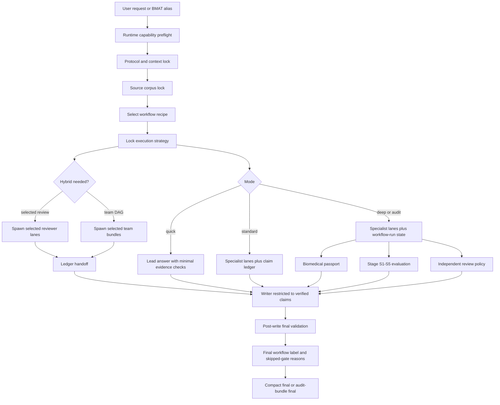

# Biomedical Agent Teams Codex Marketplace

Local Codex Desktop marketplace package for the Biomedical Agent Teams plugin.

Current plugin version: `0.3.4+codex.20260610`.

## Install

```powershell
codex plugin marketplace add "G:\내 드라이브\work\codex\work\plugins\biomedical-agent-teams-codex-marketplace"
codex plugin add biomedical-agent-teams@biomedical-agent-teams-marketplace
```

The plugin body is in `plugins/biomedical-agent-teams/` and exposes the
`biomedical-agent-teams` skill with 35 agent prompts, 6 command recipes, a
fixed-field claim-ledger template, contract schemas, biomedical passport state,
runtime capability preflight, source corpus lock, workflow-run state, stage
evaluation, hypothesis tournament, independent-review policy, and
inline-first hybrid execution, selective spawned review, team-level spawned
workflow DAGs, and integrity-gate resources.

## Workflow Structure



For BioAgentBench-style tasks, the benchmark protocol is locked before solving.
Truth files, result archives, scoring scripts, reproduction scripts, and task
Dockerfiles are scoring-phase materials and are not exposed to the solving
agent before the candidate output is frozen.
