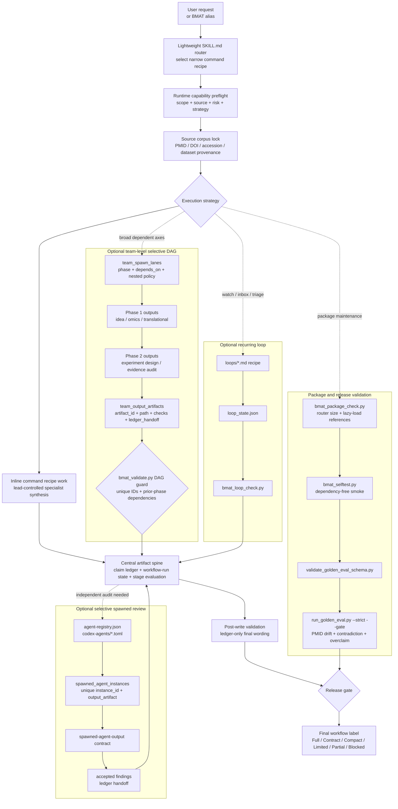

# Biomedical Agent Teams Codex Marketplace

Codex Desktop marketplace package for the Biomedical Agent Teams plugin.

Current plugin version: `0.4.9`.

## Install

Clone this repository, then register the local marketplace path:

```powershell
git clone https://github.com/kdh-isaac/biomedical-agent-teams-codex-marketplace
codex plugin marketplace add "<path-to-clone>"
codex plugin add biomedical-agent-teams@biomedical-agent-teams-marketplace
```

The plugin body is in `plugins/biomedical-agent-teams/` and exposes the
`biomedical-agent-teams` skill with 35 agent prompts, 6 command recipes, loop
engineering resources, connector binding, a lightweight lazy-loaded router,
agent registry metadata, Codex
reviewer-agent TOML templates, workflow-run spawned instance tracking,
team-level DAG output tracking, deterministic artifact validators, and
validator-backed release gates with golden-case eval coverage for PMID drift,
contradiction, and overclaim detection.

## Workflow Structure



The workflow is router-first: `SKILL.md` stays small and loads only the selected
command recipe. The lead agent owns preflight, source locking, the central
ledger, post-write validation, and the final label. Execution strategy is
either `inline_first_selective_review` (default, lead-controlled inline work
with selected reviewer roles) or `team_level_selective_dag` for broad,
dependent decisions that spawn command-level teams across the DAG above.
Optional lanes feed evidence back into that artifact spine. Team DAG claims
are proven by unique `team_spawn_lanes` and `team_output_artifacts` records
with prior-phase dependencies; reviewer execution is proven by unique
`spawned_agent_instances`; recurring loops are checked by
`bmat_loop_check.py`. Full-protocol release requires post-write validation
and `bmat_validate.py` on the complete bundle, while package releases
additionally run the package/selftest/golden-eval gates.

## Contents

- `.agents/plugins/marketplace.json`: local marketplace metadata.
- `plugins/biomedical-agent-teams/`: Codex plugin body.
- `plugins/biomedical-agent-teams/skills/biomedical-agent-teams/`: skill
  router, agents, commands, contracts, templates, references, loops, tests, and
  validators.

## Validation

The 0.4.9 package is validated with:

```powershell
python -m pip install ".[dev]"
python plugins/biomedical-agent-teams/skills/biomedical-agent-teams/scripts/bmat_package_check.py --root plugins/biomedical-agent-teams
python plugins/biomedical-agent-teams/skills/biomedical-agent-teams/scripts/bmat_selftest.py --root plugins/biomedical-agent-teams
python -m pytest -q
python plugins/biomedical-agent-teams/skills/biomedical-agent-teams/evals/validate_golden_eval_schema.py --tasks plugins/biomedical-agent-teams/skills/biomedical-agent-teams/evals/golden_tasks.jsonl --outputs plugins/biomedical-agent-teams/skills/biomedical-agent-teams/evals/sample_outputs.jsonl
python plugins/biomedical-agent-teams/skills/biomedical-agent-teams/evals/run_golden_eval.py --tasks plugins/biomedical-agent-teams/skills/biomedical-agent-teams/evals/golden_tasks.jsonl --outputs plugins/biomedical-agent-teams/skills/biomedical-agent-teams/evals/sample_outputs.jsonl --strict --gate
```

This is exactly what `.github/workflows/ci.yml` runs on every push/PR across
Ubuntu, macOS, and Windows for Python 3.10-3.13 (no live network or model
calls; all checks are deterministic and offline).

## Release Process

1. Decide the new version (semver). Update it in all four places together:
   `plugins/biomedical-agent-teams/skills/biomedical-agent-teams/VERSION`,
   `plugins/biomedical-agent-teams/.codex-plugin/plugin.json` (`version`),
   `plugins/biomedical-agent-teams/skills/biomedical-agent-teams/manifest.json`
   (`version` and `adapter_version`), and
   `plugins/biomedical-agent-teams/skills/biomedical-agent-teams/agent-registry.json`
   (`version`).
2. Add a `## v<version> Updates` section to both `README.md` and
   `plugins/biomedical-agent-teams/README.md`, describing what changed.
3. Run the Validation commands above locally; they must all pass.
4. Note whether the change is behavior-preserving (patch/minor) or changes
   validator pass/fail behavior for existing bundles (treat as a
   behavior-change release even if the version bump looks small, and say so
   explicitly in the changelog entry).
5. Commit, then tag and push: `git tag v<version> && git push origin main
   v<version>`.
6. `.github/workflows/release.yml` runs on the tag push. It refuses to
   release if the tag does not match `VERSION`/`plugin.json`/`manifest.json`,
   reruns the full gate suite, and publishes a GitHub Release with a
   `release-manifest.json` (commit SHA, gates passed, and an explicit
   `benchmark_status` field so a release never implies a live-model benchmark
   result it did not actually run).
