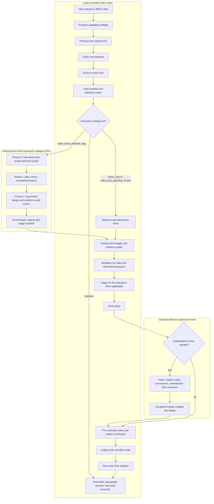

# Biomedical Agent Teams Codex Plugin

Codex Desktop compatible plugin wrapper for the `biomedical-agent-teams` skill.

## Contents

- `.agents/plugins/marketplace.json`: local marketplace metadata.
- `skills/biomedical-agent-teams/`: Codex-native biomedical agent-team skill,
  including 35 agent prompts, 6 workflow recipes, 10 contract schemas, 10
  templates, 7 references, a fixed-field claim ledger, biomedical passport,
  runtime capability preflight, source corpus lock, workflow-run state, stage
  evaluation, hypothesis tournament, independent-review policy, inline-first
  hybrid execution, selective spawned review, team-level spawned workflow DAGs,
  and integrity-gate resources.

## v0.3.4 Updates

- Makes BMAT explicitly lead-controlled and inline-first by default.
- Adds `inline_first_selective_review` for professional/auditable workflows:
  the main workflow runs inline while only selected reviewer roles are spawned
  for independent evidence, citation, contradiction, biostats, provenance, or
  risk-of-bias review.
- Adds `team_level_selective_dag` for broad decisions: selected command-level
  teams can be spawned as workflow bundles in dependency-aware phases.
- Disables nested spawning by default. A spawned team runs its internal recipe
  inline and returns one formal team report unless explicit nested-spawn
  approval is recorded.
- Adds `references/hybrid-execution-policy.md`,
  `templates/team-spawn-plan-template.md`, and execution-strategy fields to the
  preflight and workflow-run contracts.

## Workflow Structure



The main lead owns the protocol lock, source scope, central claim ledger,
workflow-run state, and final synthesis. Team-level spawned subagents are used
only for separable decision axes; selective spawned reviewers are used only
after ledger claims exist. Nested spawning is disabled by default.

## v0.3.2 Updates

- Adds benchmark hygiene rules for BioAgentBench-style hidden truth/result
  files, scoring scripts, reproduction scripts, and task Dockerfiles.
- Clarifies that truth/result materials are scoring-phase only and must not be
  exposed to the solving agent before final candidate output is frozen.

## v0.3.1 Updates

- Ensures every command recipe final output requires a final workflow label and
  skipped-gate reasons.
- Strengthens smoke tests for router-advertised bundled resources, source
  manifest command/agent existence, Markdown resource references, and v0.3
  schema sample payload validation.

## v0.3.0 Updates

- Adds runtime capability preflight so workflows record actual Codex support for
  web/search, shell/code execution, file writes, network/database access,
  spawned subagents, sandbox, and downgrade rules.
- Adds workflow-run stage DAG state for deep, audit, omics run, translational,
  manuscript-support, generated-file, and long-running workflows.
- Promotes source corpus handling into a standalone source lock with schema and
  template.
- Adds hypothesis tournament resources for idea-discovery and research-council
  ideation workflows.
- Adds S1-S5 stage evaluation for omics run/audit and generated-file workflows,
  with a blocking rule when S3 Validate fails.
- Adds independent-review policy distinguishing spawned/tool-backed validation
  from same-model separate-pass validation.
- Adds rollback/resume artifact convention for durable `.bmat/run-*` style
  state.

## v0.2.4 Updates

- Adds command-level preflight contract requirements to all six workflow
  recipes.
- Adds biomedical passport state tracking to the evidence-audit recipe.
- Updates the workflow-spine manifest to include passport and integrity gates.
- Removes a zero-byte `.Rhistory` packaging artifact from the commands folder.

## v0.2.3 Updates

- Adds validator-friendly contract schemas for preflight, role outputs,
  biomedical passport state, omics run manifests, and post-write validation.
- Adds biomedical passport and integrity-gate templates.
- Adds a BMAT-specific failure-mode taxonomy for fabricated identifiers,
  citation-context drift, bulk-to-cell-intrinsic overclaim, metadata leakage,
  post-hoc endpoint inflation, missing uncertainty, unsafe/private disclosure,
  clinical overreach, provenance gaps, and writer/reviewer self-ratification.
- Adds formal return contracts for the lead scientist, final writer, omics
  curator, analysis workers, pathway interpreter, omics reviewers, and reporter.
- Requires passport and integrity-gate status in deep/audit/omics/translational
  audit-bundle outputs when applicable.

## v0.2.2 Updates

- Adds a mandatory preflight compliance contract for aliased workflows.
- Distinguishes role prompts read inline, formal role outputs, tool calls, and
  spawned subagents.
- Defines mode-specific minimum artifacts and final workflow labels.
- Adds `safe_mode_note` handling for low-risk public-only workflows with safety
  triggers.
- Adds a post-write self-check to `biomedical-research-council`.

## v0.2.1 Updates

- Adds explicit `quick`, `standard`, `deep`, and `audit` mode routing.
- Adds `templates/claim-ledger-template.md` for central claim ledgers and
  excluded / not-ledger-verified claim tracking.
- Adds bulk, single-cell, survival, and multi-omics track checklists.
- Resolves report output paths from the active workspace instead of a hard-coded
  OS-specific path.
- Splits final responses into `compact final` and `audit bundle final`.

## Install

From any shell:

```bash
codex plugin marketplace add "G:\내 드라이브\work\codex\work\plugins\biomedical-agent-teams-codex-marketplace"
codex plugin add biomedical-agent-teams@biomedical-agent-teams-marketplace
```

Then restart Codex Desktop if the plugin list does not refresh immediately.

## Primary Aliases

- `biomedical-research-council`
- `idea-discovery-team`
- `omics-analysis-team`
- `evidence-audit-team`
- `experiment-design-team`
- `translational-scout-team`

Slash-prefixed aliases may be reserved by some Codex clients. If that happens,
use the plain alias form.
