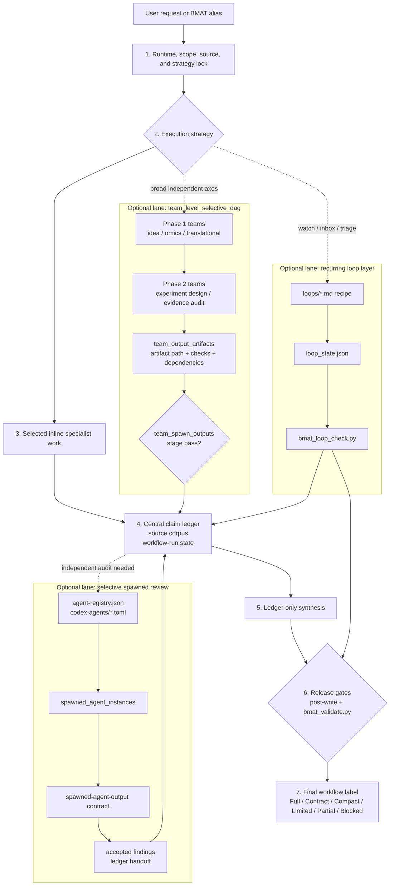

# Biomedical Agent Teams Codex Plugin

Codex Desktop compatible plugin wrapper for the `biomedical-agent-teams` skill:
a lead-controlled biomedical audit and loop-engineering workflow with optional
spawned or tool-backed review.

## Contents

- `.agents/plugins/marketplace.json`: local marketplace metadata.
- `skills/biomedical-agent-teams/`: Codex-native biomedical agent-team skill,
  including 35 agent prompts, 6 workflow recipes, 13 contract schemas, 12
  templates, 9 references, 4 loop recipes, 11 Codex reviewer-agent templates,
  an agent registry, a fixed-field claim ledger, biomedical passport,
  runtime capability preflight, source corpus lock, workflow-run state, stage
  evaluation, hypothesis tournament, independent-review policy, inline-first
  hybrid execution, selective spawned review, team-level spawned workflow DAGs,
  integrity-gate resources, loop-state resources, connector binding, Codex
  reviewer-agent templates, team output artifact tracking, and deterministic
  BMAT artifact and loop-state validators. `SKILL.md` is a lightweight router;
  command recipes, references, templates, and contracts are lazy-loaded from the
  selected alias and `source-manifest.json`.

## v0.4.9 Updates

- Replaces the large root `SKILL.md` manual with a lightweight router that
  lazy-loads `commands/*.md` recipes and discovers broader resources through
  `source-manifest.json` and `scripts/bmat_docs_list.py`.
- Adds a package-check router size ceiling plus lazy-load and validator-runtime
  downgrade guards.
- Adds a 20-case golden eval gate and schema wrapper for PMID drift,
  contradiction, overclaim, provenance/statistics, and negative-control cases.
- Records `validator_unavailable_due_to_runtime` as an explicit preflight and
  final-label downgrade reason when `scripts/bmat_validate.py` cannot run.
- Updates package metadata to version 0.4.9.

## v0.4.8 Updates

- Adds `README.quickstart.md` with workflow selection, mode routing, and bundle
  setup examples.
- Improves `scripts/bmat_docs_list.py` so references, loops, and templates
  without frontmatter summaries still get useful fallback summaries.
- Adds `scripts/bmat_init_bundle.py` to scaffold BMAT artifact bundles with the
  validator's standard filenames.
- Adds `scripts/bmat_selftest.py` for dependency-free package, loop, bundle, and
  golden-eval smoke checks when `pytest` is unavailable.
- Updates package metadata to version 0.4.8.

## v0.4.7 Updates

- Requires `source-manifest.json` resource arrays to exactly match the packaged
  command, agent, contract, template, reference, loop, script, and Codex agent
  template file sets.
- Adds package-check regression coverage for a missing `omics-analysis-team`
  command manifest entry when the actual command file still exists.
- Updates package metadata to version 0.4.7.

## v0.4.6 Updates

- Adds a workflow-structure guard requiring command recipes to resolve relative
  to the active `SKILL.md` directory, preventing stale dated workspace copies
  from masquerading as the installed BMAT workflow during smoke tests.
- Limits `interface.defaultPrompt` to the Codex loader maximum of three prompts.
- Extends `scripts/bmat_package_check.py` so package validation fails on excess
  default prompts or a missing router root-resolution guard.
- Updates package metadata to version 0.4.6.

## v0.4.5 Updates

- Routes requests that require substantive omics feasibility assessment,
  public-cohort execution, code-bearing omics analysis, or omics result audit
  through `omics-analysis-team` as the primary omics workflow or as the omics
  axis of a broader team DAG.
- Strengthens omics `run` governance so at least one spawned or tool-backed
  core reviewer runs after S1-S3 locks and alongside S4/S5 when practical.
- Makes `omics-code-reviewer` the default required reviewer for runs that
  generate, modify, or materially depend on scripts, notebooks, shell commands,
  statistical code, or workflow configs.
- Updates package metadata to version 0.4.5.

## v0.4.4 Updates

- Adds `scripts/bmat_package_check.py` to validate package-wide version
  alignment, manifest counts, source-manifest resources, agent-registry
  bindings, TOML template versions, and router resource references.
- Adds `scripts/bmat_docs_list.py` as a compact command/reference/loop/template
  inventory helper for routing and release review.
- Adds `templates/bmat-handoff-template.md` and
  `templates/bmat-pickup-template.md` for resumable BMAT work and source/cache
  parity handoffs.
- Expands repository tests so package metadata, resource counts, CLI validators,
  and current workflow diagrams are checked together before cache updates.

## v0.4.3 Updates

- Tightens omics `run` behavior so reviewer spawning is opt-out after S1-S3
  locks, not silently optional.
- Requires the omics preflight to select at least one core reviewer
  (`omics-code-reviewer`, `omics-provenance-validator`, or
  `biostats-repro-auditor`) when spawned subagents or tool-backed reviewer
  instances are available.
- Adds deterministic validator policy for omics `run` bundles: zero reviewer
  budget now fails unless a runtime, privacy, budget, or explicit user-compact
  downgrade rationale is recorded.
- Adds pytest coverage for omitted omics reviewer spawning, downgrade-allowed
  skips, non-core reviewer selection, and completed core reviewer instances.

## v0.4.2 Updates

- Adds an explicit completion-read gate: the router `SKILL.md` and selected
  command recipe must be read to EOF before source expansion, external tool use,
  file writes, code execution, or final wording.
- Adds workflow-label ceilings so `Compact standard workflow` requires
  preflight, source corpus, claim ledger, and post-write validation artifacts.
- Extends `scripts/bmat_validate.py` to audit `final.md` workflow labels even
  when no bundle exists, blocking compact or full labels that lack required
  artifacts.
- Clarifies that one-off requests should record loop status as
  `not-applicable`; a missing `loop_state.json` is only a loop failure for
  recurring, watch, monitor, inbox, or triage workflows.

## v0.4.1 Updates

- Adds `workflow-run.team_output_artifacts` for concrete command-level spawned
  team bundle outputs, separate from reviewer `spawned_agent_instances`.
- Hardens `scripts/bmat_validate.py` so complete `team_spawn_lanes` rows require
  matching complete team output artifacts, ledger handoff, and checks.
- Enforces Phase 2+ team DAG dependencies against prior complete team lanes or
  prior complete team output artifact IDs.
- Blocks nested team spawning when `nested_spawn_allowed` is false.
- Updates workflow templates and hybrid execution docs to make
  `team_spawn_outputs` the deterministic team DAG verification stage.

## v0.4.0 Updates

- Adds loop-engineering support for recurring `weekly-literature-watch`,
  `public-omics-dataset-watch`, `claim-audit-inbox`, and `hypothesis-triage`
  workflows.
- Adds `contracts/loop-state.schema.json` to record public/private boundary,
  allowed connectors, source-delta status, cycle budget, reviewer objections,
  stop conditions, output artifacts, and privacy boundary.
- Adds `scripts/bmat_loop_check.py` plus fixtures and tests to block loop
  release when private context lacks human approval, source deltas remain
  pending, reviewer objections remain open, or cycle budget is exceeded.
- Adds `references/connector-binding-matrix.md` for workflow and loop connector
  permissions, downgrade labels, and reviewer-lane bindings.
- Adds `agent-registry.json`, `contracts/agent-registry.schema.json`, and
  `contracts/spawned-agent-output.schema.json` to bind spawnable role prompts,
  TOML templates, privacy levels, and output contracts.
- Expands `codex-agents/*.toml` templates from 4 to 11 reviewer subagents and
  records actual spawned executions via `workflow-run.spawned_agent_instances`.
- Updates package metadata to version 0.4.0.

## v0.3.6 Updates

- Lowers BMAT's default description from mechanically gated to
  contract-described unless `scripts/bmat_validate.py` is run against a complete
  artifact bundle.
- Adds `scripts/bmat_validate.py` to enforce full-protocol label,
  independent-review surface, S3 validation, source-backed claim, final-wording,
  and post-write release policies.
- Adds validator fixtures and subprocess tests for valid full protocol,
  missing independent review, failed S3 validation, missing source corpus links,
  and final wording drift.
- Adds an offline golden-task eval scaffold for measuring unsupported-claim,
  citation-drift, fabricated-identifier, and overclaim-downgrade detection.

## v0.3.5 Updates

- Makes BMAT explicitly lead-controlled and inline-first by default.
- Adds `inline_first_selective_review` for professional/auditable workflows:
  the main workflow runs inline while only selected reviewer roles are spawned
  for independent evidence, citation, contradiction, biostats, provenance, or
  risk-of-bias review.
- Adds `team_level_selective_dag` for broad decisions: selected command-level
  teams can be spawned as workflow bundles in dependency-aware phases.
- Disables nested spawning by default. A spawned team runs its internal recipe
  inline and returns one formal team report unless explicit nested-spawn
  approval is recorded.
- Adds `references/hybrid-execution-policy.md`,
  `templates/team-spawn-plan-template.md`, and execution-strategy fields to the
  preflight and workflow-run contracts.

## Workflow Structure



The main workflow progresses vertically from request lock to final label. The
lead owns the lock, selected inline work, claim ledger, workflow-run state, and
final synthesis. Optional lanes run only when the strategy calls for them, then
feed evidence back into the ledger: team DAG outputs are proven by
`team_output_artifacts`, reviewer execution is proven by
`spawned_agent_instances`, and recurring loops are checked by
`bmat_loop_check.py`. Full-protocol release requires the post-write validator
and `bmat_validate.py` to pass against the complete artifact bundle.

## v0.3.2 Updates

- Adds benchmark hygiene rules for BioAgentBench-style hidden truth/result
  files, scoring scripts, reproduction scripts, and task Dockerfiles.
- Clarifies that truth/result materials are scoring-phase only and must not be
  exposed to the solving agent before final candidate output is frozen.

## v0.3.1 Updates

- Ensures every command recipe final output requires a final workflow label and
  skipped-gate reasons.
- Strengthens smoke tests for router-advertised bundled resources, source
  manifest command/agent existence, Markdown resource references, and v0.3
  schema sample payload validation.

## v0.3.0 Updates

- Adds runtime capability preflight so workflows record actual Codex support for
  web/search, shell/code execution, file writes, network/database access,
  spawned subagents, sandbox, and downgrade rules.
- Adds workflow-run stage DAG state for deep, audit, omics run, translational,
  manuscript-support, generated-file, and long-running workflows.
- Promotes source corpus handling into a standalone source lock with schema and
  template.
- Adds hypothesis tournament resources for idea-discovery and research-council
  ideation workflows.
- Adds S1-S5 stage evaluation for omics run/audit and generated-file workflows,
  with a blocking rule when S3 Validate fails.
- Adds independent-review policy distinguishing spawned/tool-backed validation
  from same-model separate-pass validation.
- Adds rollback/resume artifact convention for durable `.bmat/run-*` style
  state.

## v0.2.4 Updates

- Adds command-level preflight contract requirements to all six workflow
  recipes.
- Adds biomedical passport state tracking to the evidence-audit recipe.
- Updates the workflow-spine manifest to include passport and integrity gates.
- Removes a zero-byte `.Rhistory` packaging artifact from the commands folder.

## v0.2.3 Updates

- Adds validator-friendly contract schemas for preflight, role outputs,
  biomedical passport state, omics run manifests, and post-write validation.
- Adds biomedical passport and integrity-gate templates.
- Adds a BMAT-specific failure-mode taxonomy for fabricated identifiers,
  citation-context drift, bulk-to-cell-intrinsic overclaim, metadata leakage,
  post-hoc endpoint inflation, missing uncertainty, unsafe/private disclosure,
  clinical overreach, provenance gaps, and writer/reviewer self-ratification.
- Adds formal return contracts for the lead scientist, final writer, omics
  curator, analysis workers, pathway interpreter, omics reviewers, and reporter.
- Requires passport and integrity-gate status in deep/audit/omics/translational
  audit-bundle outputs when applicable.

## v0.2.2 Updates

- Adds a mandatory preflight compliance contract for aliased workflows.
- Distinguishes role prompts read inline, formal role outputs, tool calls, and
  spawned subagents.
- Defines mode-specific minimum artifacts and final workflow labels.
- Adds `safe_mode_note` handling for low-risk public-only workflows with safety
  triggers.
- Adds a post-write self-check to `biomedical-research-council`.

## v0.2.1 Updates

- Adds explicit `quick`, `standard`, `deep`, and `audit` mode routing.
- Adds `templates/claim-ledger-template.md` for central claim ledgers and
  excluded / not-ledger-verified claim tracking.
- Adds bulk, single-cell, survival, and multi-omics track checklists.
- Resolves report output paths from the active workspace instead of a hard-coded
  OS-specific path.
- Splits final responses into `compact final` and `audit bundle final`.

## Install

From any shell:

```bash
codex plugin marketplace add "G:\내 드라이브\work\codex\work\plugins\biomedical-agent-teams-codex-marketplace"
codex plugin add biomedical-agent-teams@biomedical-agent-teams-marketplace
```

Then restart Codex Desktop if the plugin list does not refresh immediately.

## Primary Aliases

- `biomedical-research-council`
- `idea-discovery-team`
- `omics-analysis-team`
- `evidence-audit-team`
- `experiment-design-team`
- `translational-scout-team`

Slash-prefixed aliases may be reserved by some Codex clients. If that happens,
use the plain alias form.
