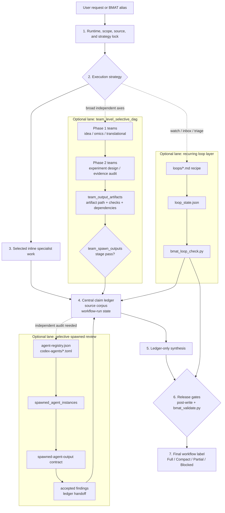

# Biomedical Agent Teams

Codex biomedical agent-team bundle with a protocol lock, central claim ledger,
audit gates, writer restriction, post-write final validation, loop-state
resources, connector binding, team output artifact tracking, and optional
deterministic artifact validators.

Codex uses `SKILL.md` as the router and treats `agents/*.md` as role prompts.

## v0.4.7 Updates

- Requires `source-manifest.json` resource arrays to exactly match the packaged
  file sets for commands, agents, contracts, templates, references, loops,
  scripts, and Codex agent templates.
- Adds a regression test for the previously missed case where
  `omics-analysis-team` was absent from the command manifest while the actual
  command file still existed.
- Updates metadata and templates to 0.4.7.

## v0.4.6 Updates

- Requires BMAT aliases and command recipes to resolve from the active
  `SKILL.md` directory so old local working copies cannot shadow the installed
  cache during workflow smoke tests.
- Keeps plugin `defaultPrompt` entries within the Codex loader limit of three.
- Adds package-check coverage for prompt-limit and router-root guard regressions.
- Updates metadata and templates to 0.4.6.

## v0.4.5 Updates

- Makes `omics-analysis-team` the default routing axis whenever a BMAT request
  requires substantive omics feasibility, execution, or audit.
- Requires at least one spawned or tool-backed core omics reviewer after S1-S3
  locks for omics `run` when runtime support is available, with review running
  alongside S4/S5 when practical.
- Makes `omics-code-reviewer` the default required reviewer for code-bearing
  omics runs.
- Updates metadata and templates to 0.4.5.

## v0.4.4 Updates

- Adds `scripts/bmat_package_check.py` for package-wide version, resource,
  registry, router-reference, and manifest-count validation.
- Adds `scripts/bmat_docs_list.py` to list command, reference, loop, and
  template resources during routing and release checks.
- Adds `templates/bmat-handoff-template.md` and
  `templates/bmat-pickup-template.md` for concise current-state handoff and
  resume verification.
- Updates metadata and tests so source tree, active marketplace source, and
  installed cache can be checked with the same package validator.

## v0.4.3 Updates

- Makes omics `run` reviewer spawning stricter after S1-S3 locks: select at
  least one core reviewer when spawned or tool-backed reviewer support exists.
- Defines the core omics reviewer floor as `omics-code-reviewer`,
  `omics-provenance-validator`, or `biostats-repro-auditor`.
- Extends `scripts/bmat_validate.py` to flag omics runs with zero reviewer
  budget unless an explicit runtime, privacy, budget, or user-compact downgrade
  reason is recorded.
- Adds regression tests for omitted reviewer spawning, explicit downgrade
  exceptions, non-core reviewer selection, and successful core reviewer
  instances.

## v0.4.2 Updates

- Adds an explicit completion-read gate before source expansion, external tool
  use, file writes, code execution, or final wording.
- Adds workflow-label ceilings so compact standard and full-protocol labels are
  available only when their required artifacts actually exist.
- Extends `scripts/bmat_validate.py` to audit declared workflow labels in
  `final.md`, catching compact/full label claims that lack preflight, source
  corpus, claim ledger, post-write validation, or full-protocol run state.
- Clarifies one-off loop handling: missing loop state is `not-applicable` unless
  the request is recurring, scheduled, monitored, inbox-style, or triage-loop
  work.

## v0.4.1 Updates

- Adds `workflow-run.team_output_artifacts` for actual command-level spawned
  team bundle outputs, separate from reviewer `spawned_agent_instances`.
- Hardens `scripts/bmat_validate.py` so complete `team_spawn_lanes` rows require
  matching complete team output artifacts, ledger handoff, and checks.
- Enforces Phase 2+ team DAG dependencies against prior complete team lanes or
  prior complete team output artifact IDs.
- Blocks nested team spawning when `nested_spawn_allowed` is false.
- Updates workflow templates and hybrid execution docs to make
  `team_spawn_outputs` the deterministic team DAG verification stage.

## v0.4.0 Updates

- Adds loop-engineering recipes under `loops/` for recurring literature watch,
  public omics dataset watch, claim audit inbox, and hypothesis triage.
- Adds `contracts/loop-state.schema.json` and `scripts/bmat_loop_check.py` to
  validate loop privacy boundaries, source-delta completion, reviewer-objection
  resolution, human gates, and cycle budgets before release.
- Adds loop-check tests and fixtures for valid, private-external, pending-source,
  and unhandled-reviewer-objection loop states.
- Adds `references/connector-binding-matrix.md` to bind workflows and loops to
  preferred public connectors and downgrade labels.
- Adds `agent-registry.json`, `contracts/agent-registry.schema.json`, and
  `contracts/spawned-agent-output.schema.json` to bind spawnable role prompts,
  TOML templates, privacy levels, and output contracts.
- Expands `codex-agents/*.toml` reviewer templates from 4 to 11 and records
  actual spawned executions via `workflow-run.spawned_agent_instances`.
- Bumps package metadata and templates to 0.4.0.

## Workflow Structure



The main workflow progresses vertically from request lock to final label. The
lead owns the lock, selected inline work, claim ledger, workflow-run state, and
final synthesis. Optional lanes run only when the strategy calls for them, then
feed evidence back into the ledger: team DAG outputs are proven by
`team_output_artifacts`, reviewer execution is proven by
`spawned_agent_instances`, and recurring loops are checked by
`bmat_loop_check.py`. Full-protocol release requires the post-write validator
and `bmat_validate.py` to pass against the complete artifact bundle.

## v0.3.6 Updates

- Adds `scripts/bmat_validate.py` for deterministic BMAT artifact policy
  validation.
- Clarifies that BMAT is contract-described by default; gates are
  validator-enforced only when the validator is run against a complete artifact
  bundle.
- Restricts `Full protocol followed` to bundles with mandatory artifacts,
  passing gates, post-write validation, and an independent or tool-backed
  validation surface.
- Adds fixture tests for missing independent review, S3 validation failure,
  missing source-corpus links, and final wording drift.
- Adds an offline golden-task eval scaffold for later measurement without
  automatic external model calls.

## v0.3.5 Updates

- Defines BMAT as lead-controlled and inline-first by default.
- Adds selective spawned review for high-confidence or auditable outputs without
  mechanically spawning every role.
- Adds dependency-aware team-level spawned workflows for broad decisions that
  genuinely benefit from parallel `idea-discovery-team`, `omics-analysis-team`,
  `translational-scout-team`, `experiment-design-team`, or
  `evidence-audit-team` bundles.
- Requires spawned teams to run internal roles inline and return one formal team
  report unless nested spawning is explicitly authorized.
- Adds `references/hybrid-execution-policy.md`,
  `templates/team-spawn-plan-template.md`, and execution-strategy fields in the
  preflight/workflow-run schemas.

## v0.3.2 Updates

- Adds benchmark hygiene guardrails for BioAgentBench-style tasks with hidden
  truth files, result archives, scoring scripts, reproduction scripts, and task
  Dockerfiles.
- Updates omics workflow rules to keep benchmark solve and scoring phases
  separated.

## v0.3.1 Updates

- Makes command-level final output requirements self-contained by adding final
  workflow label and skipped-gate reporting to every command recipe.
- Adds stronger package tests for router resource references, source-manifest
  command and agent roster existence, Markdown file references, and v0.3 schema
  sample payload validation.

## v0.3.0 Updates

- Adds runtime capability preflight with schema/template and Codex capability
  matrix reference.
- Adds workflow-run state with stage DAG and downgrade reasons.
- Promotes source corpus lock to a standalone schema/template.
- Adds hypothesis tournament schema/template/reference for idea discovery.
- Adds S1-S5 stage evaluation schema/template and omics validation failure modes.
- Adds independent-review policy for independent validation versus same-model
  separate-pass validation.
- Adds rollback/resume template for durable workflow artifacts.
- Updates all six command recipes to mention runtime capability, source lock,
  workflow state, stage validation where relevant, and independent-review
  status.

## v0.2.4 Updates

- Adds command-level preflight contract requirements to every alias workflow,
  so command recipes remain self-contained when read directly.
- Adds biomedical passport state to the evidence-audit workflow.
- Updates the source manifest workflow spine to include passport and integrity
  gates explicitly.
- Removes a zero-byte `.Rhistory` packaging artifact from `commands/`.

## v0.2.3 Updates

- Adds `contracts/` JSON schemas for preflight contracts, formal role outputs,
  biomedical passport state, omics run manifests, and post-write validation.
- Adds `templates/biomedical-passport-template.md` and
  `templates/integrity-gate-template.md`.
- Adds `references/contract-gated-workflows.md` and
  `references/biomedical-failure-modes.md`.
- Adds formal return contracts for the lead scientist, final writer, omics
  data curator, bulk/single-cell/pathway workers, omics code/provenance
  reviewers, and omics reporter.
- Requires biomedical passport and integrity-gate status for deep, audit, omics
  run, translational, manuscript-support, and long-running audit-bundle outputs
  when applicable.

## v0.2.1 Updates

- Adds explicit `quick`, `standard`, `deep`, and `audit` mode routing to prevent
  over-loading every agent by default.
- Adds `templates/claim-ledger-template.md` for fixed-field claim ledgers and
  excluded / not-ledger-verified claim tracking.
- Adds track-specific omics checklists for bulk, single-cell, survival, and
  multi-omics workflows.
- Resolves final output paths from the active workspace instead of hard-coding a
  macOS Google Drive path.
- Splits final responses into `compact final` and `audit bundle final` modes.

## Included Commands

- `/biomedical-research-council`: full PI-style research council.
- `/idea-discovery-team`: CAR cell therapy and immunology idea generation, ranking, red-team critique, and experimental planning.
- `/omics-analysis-team`: public-omics dataset curation, bulk/single-cell/survival/pathway workflows, review gates, and provenance reporting.
- `/evidence-audit-team`: claim-level evidence, citation, provenance, statistics, and contradiction audit.
- `/experiment-design-team`: mechanistic validation, controls, sample-size logic, protocol logistics, and decision gates.
- `/translational-scout-team`: trial landscape, operational feasibility, safety/regulatory flags, and IP/competitive positioning.

## Included Agents

- `life-science-lead-scientist`
- `protocol-context-locker`
- `entity-normalizer`
- `central-claim-ledger-evidence-graph`
- `life-science-literature-curator`
- `scientific-literature-researcher`
- `public-omics-analyst`
- `immunology-mechanism-critic`
- `hypothesis-generator`
- `hypothesis-ranker`
- `contradiction-red-team`
- `experimental-design-planner`
- `citation-verifier`
- `scientific-writer-citation-agent`
- `omics-data-curator`
- `omics-code-reviewer`
- `bulk-deg-analyst`
- `scrna-qc-specialist`
- `pathway-interpreter`
- `biostats-repro-auditor`
- `omics-provenance-validator`
- `omics-reporter`
- `scenario-playbook-router`
- `claim-level-evidence-verifier`
- `causal-inference-confounder-analyst`
- `risk-of-bias-study-quality-auditor`
- `safety-ethics-privacy-dual-use-auditor`
- `bayesian-decision-modeler`
- `clinical-trial-operations-scout`
- `grant-ip-landscape-scout`
- `protocol-reagent-logistics-planner`
- `provenance-traceability-architect`
- `figure-schematic-director`
- `model-card-dataset-card-writer`
- `post-write-final-validator`

## Use

```text
/idea-discovery-team TET2 KO + IL-21 armored CAR-T에서 trafficking receptor 조합 아이디어 발굴 --mode deep
/omics-analysis-team GSE248835 axi-cel pretreatment tumor RNA-seq에서 DUSP5 high/low DEG와 pathway 확인 --track bulk --mode plan
/omics-analysis-team TCGA에서 CD3-high solid tumor의 DUSP5 high/low 생존분석 계획 --track survival --mode plan
/experiment-design-team IL-21-STAT3-FOXO1 축이 CAR-T stem-like persistence를 증가시키는지 검증 --mode deep
/biomedical-research-council TET2 KO + IL-21 armored CAR-T persistence hypothesis --mode standard
```

## Safety Boundaries

- Treat raw data as read-only.
- Do not upload private data, PHI/PII, unpublished project text, or patent-sensitive details.
- Do not fabricate PMIDs, DOIs, accessions, reagent details, or database records.
- Separate evidence, inference, hypothesis, and speculation.
- Keep bulk public-omics proxy evidence separate from CAR-T-intrinsic mechanism claims.
- Use only tools available in the active runtime. Optional MCP/database tools must never be reported as used unless actually available and called.
- Final writing must use the verified central claim ledger, and post-write
  validation must block unsupported claims or missing uncertainty.
- Useful but unsupported points must remain in the excluded / not-ledger-verified
  section instead of being blended into the conclusion.
